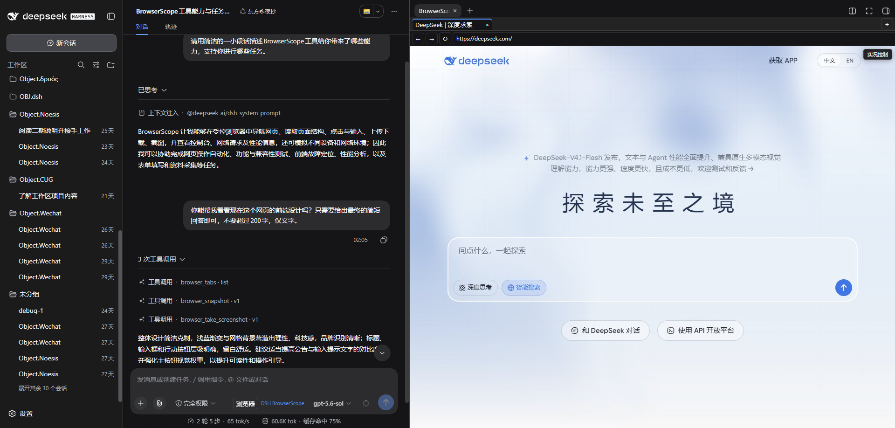
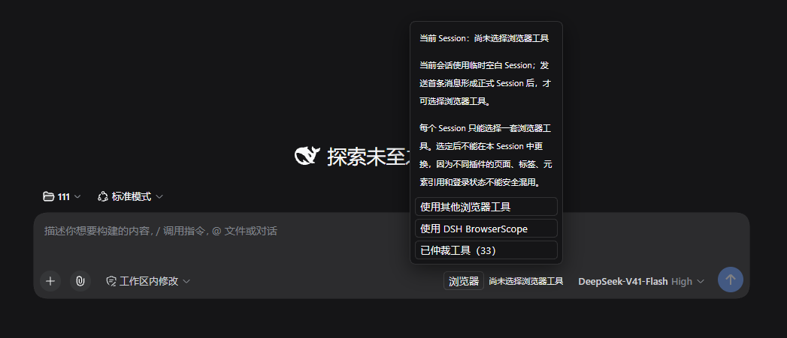
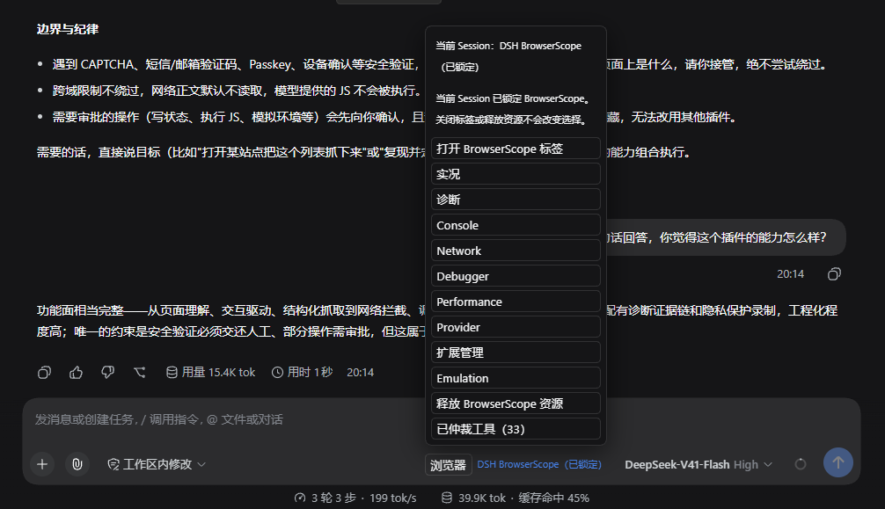
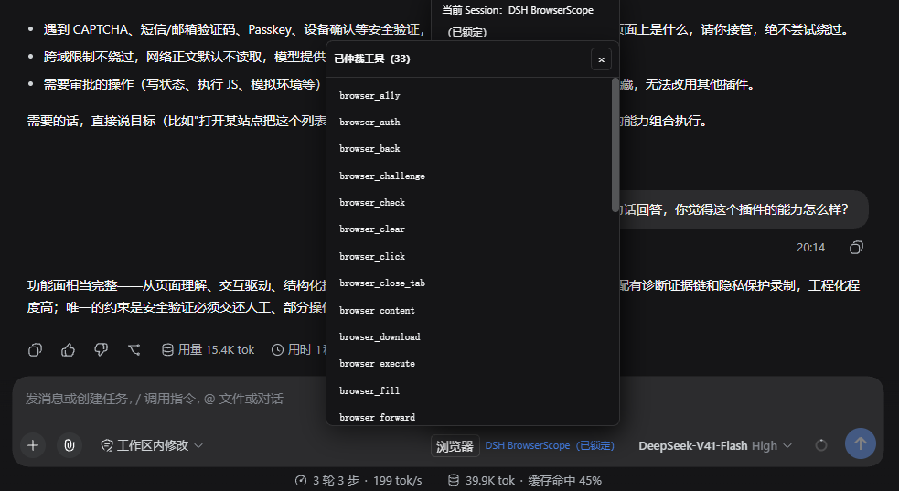
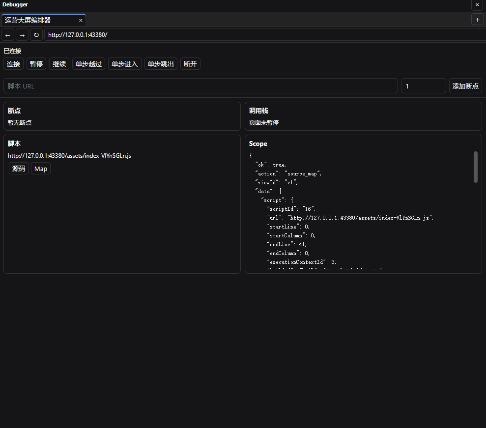
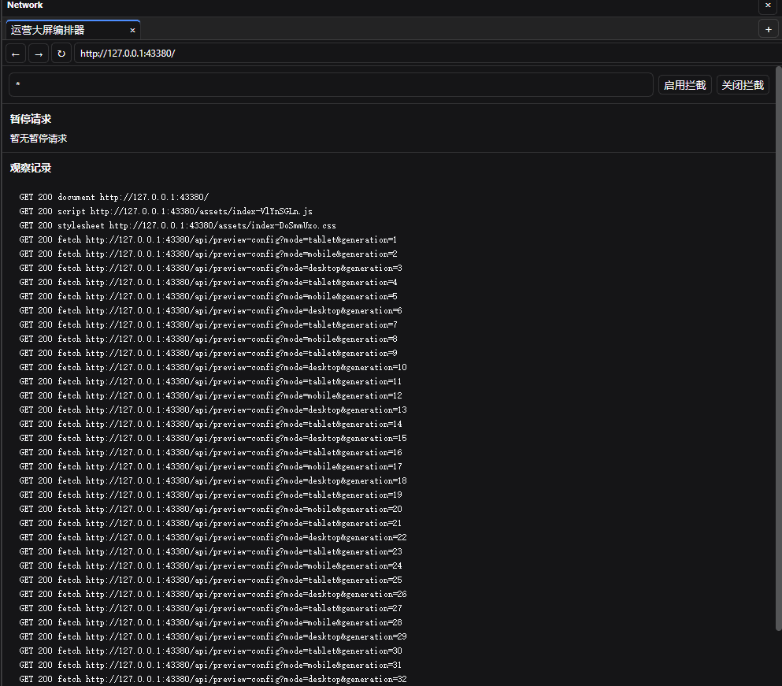
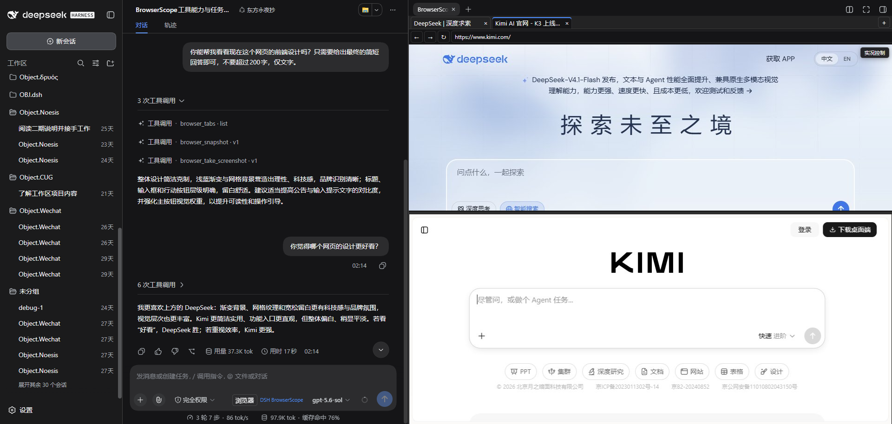
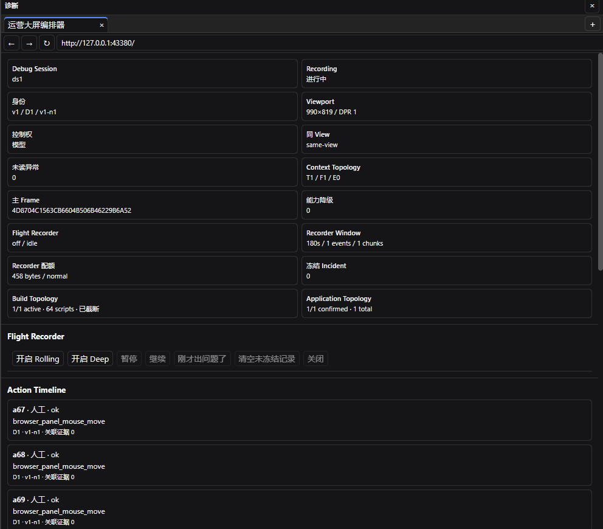
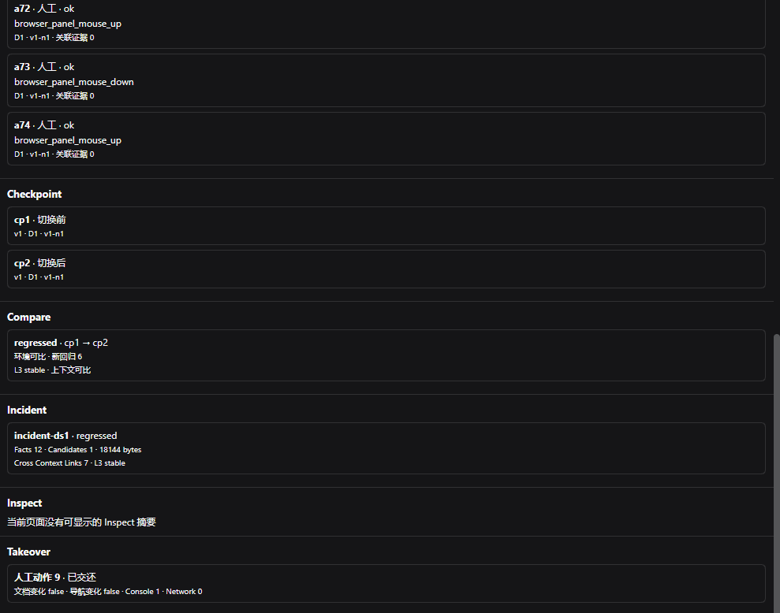
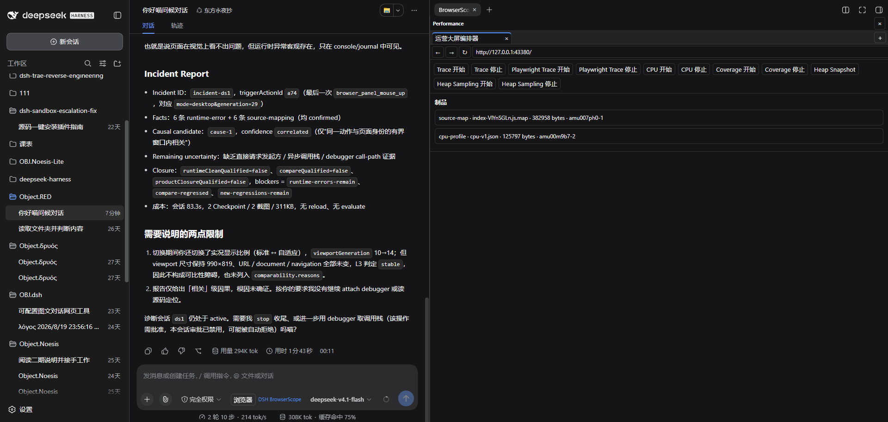

<div align="center">

# DSH BrowserScope

### Full Chromium DevTools Workbench for DSH Agents

More than just viewing pages. Click, step through breakpoints, inspect network requests, resolve Source Maps, and capture undeniable diagnostics evidence.


[Quick Install](#installation) · [Visual Tour](#feature-highlights) · [30 Tools](#tool-reference) · [Validation](#validation-results) · [Technical Specs](./TECHNICAL.en.md) · [简体中文](./README.md)

</div>

---



## Overview

What is the biggest pain point in frontend debugging? Invisible DOM trees, missed request details, inability to step through code, and error messages reduced to a single cryptic line. When autonomous agents encounter complex web issues, it's even worse — they are often stuck taking superficial screenshots, guessing causes, and repeating futile "refresh and retry" loops.

BrowserScope fundamentally changes this dynamic. It embeds a comprehensive Chromium workbench into the right sidebar of DSH Web, powered by 30 purpose-built automation tools. Agents can now directly inspect DOM nodes, interact with elements, review console logs, trace network requests, set breakpoints, read execution call stacks, resolve Source Maps, profile runtime performance, and preserve intact diagnostic evidence before and after interactions. From elementary clicks and scrolls to deep breakpoint inspection and bottleneck diagnosis, everything is handled natively within a single Session.

Furthermore, BrowserScope ensures safe multi-plugin coexistence, tailored for DSH `0.1.5-rc.2`. Each formal Session selects its browser toolset upon first use (BrowserScope or existing third-party browser tools in the current profile). Once chosen, that Session remains permanently locked to that toolset, while other Sessions can choose independently. This prevents contaminated cross-plugin states, detached tabs, and conflicted authentication sessions.

## Table of Contents

- [Validation Results](#validation-results)
- [Feature Highlights](#feature-highlights)
- [Installation](#installation)
- [Tool Reference](#tool-reference)
  - [Browsing & Interaction](#browsing--interaction)
  - [Console & Network](#console--network)
  - [Breakpoints & Sources](#breakpoints--sources)
  - [Performance & Diagnostics](#performance--diagnostics)
  - [Live View & Manual Takeover](#live-view--manual-takeover)
  - [Extensions & Environment](#extensions--environment)
  - [Session Arbitration](#session-arbitration)
- [Technical Specs](#technical-specs)
- [Compatibility](#compatibility)
- [Feedback & Issues](#feedback--issues)
- [License](#license)

## Validation Results

All tests are conducted under real Chromium, genuine DSH Web environments, and realistic production code bases, avoiding artificial mocks or simplified toy fixtures.

**Core Capabilities**

- **30 Browser Tools** fully passed in real Chromium environments.
- **9 Native Workbench Views** verified in live DSH Web workflows.
- **Multi-Plugin Coexistence** verified through session-scoped selection, locking, runtime release, independent choice, and restart persistence on DSH `0.1.5-rc.2`.
- **4 DSH Versions** tested across compatibility matrix.
- **Sustained Stress Testing** (30 min × 3 tiers) with stable performance and leak-free memory profiles.

**Verification Matrix**

| Test Track | Scope | Result |
| --- | --- | --- |
| **Complete Toolchain Regression** | All 30 tools covered end-to-end | **PASS** |
| **DSH Web Native Workbench** | 9 views + Multi-Session + Multi-Pane | **PASS** |
| **Multi-Plugin Coexistence** | Session first-choice, lock, release, isolation, restart recovery | **RC2 Live PASS** |
| **Complex Web Fault Scenarios** | Async race conditions + Multi-page navigation + Production bundles | **PASS** |
| **Multi-Version Compatibility** | 4 DSH release milestones | **PASS** |
| **Long-Running Stress** | Sustained high-frequency operations × 30 min | **STABLE** |

For complete test protocols, raw metrics, and layered breakdown, please see [VALIDATION.en.md](./VALIDATION.en.md).

## Feature Highlights

### Unified Single-Window Diagnostic Loop

Agent conversations, target web pages, tab bars, address inputs, and DevTools inspections reside synchronously in the DSH right sidebar. When anomalies occur, there is no need to alternate between disparate application windows — inspect DOM hierarchies, console logs, network events, and script call stacks in place.

**Real Scenario**: An unexpected layout glitch occurs. The Agent invokes `browser_snapshot` to inspect DOM styles, discovering a container whose `display` was asynchronously toggled to `none`. It then leverages `browser_debugger` to place a breakpoint in the offending script, traces the original position via Source Maps, and resolves the async state race condition without manual intervention.

### First-Choice Locking: Stable Session Tooling



Before the first browser interaction in a formal Session, the user or model selects either BrowserScope or pre-existing third-party browser tools. Prior to selection, browser tools remain concealed from the Agent to prevent premature invocation.



Selecting BrowserScope locks the Session exclusively to BrowserScope. Selecting third-party tools ensures BrowserScope refrains from registering tools or allocating runtime resources in that Session. Tooling cannot be swapped mid-session; switching plugins simply requires creating a new Session. Other Sessions choose independently without disturbing third-party plugin processes or configs.



Releasing BrowserScope resources safely dismantles its internal pages and debugger connections while preserving the Session's tooling lock. Tool selections automatically persist across DSH restarts and Agent Scope replacements.

### Minified Production Code? Restored Instantly



Bundle compressed into a single minified line? Connect the CDP Debugger, resolve Source Maps, and navigate the original source tree directly. Call stacks, variable scopes, and breakpoint targets are mapped back to authoring coordinates.

**Real Scenario**: A production runtime throws `Uncaught TypeError: Cannot read property 'data' of undefined` at minified coordinate `bundle.min.js:1:47392`. The Agent pauses execution via `browser_debugger`, extracts the Source Map, maps the fault directly to `src/api/fetchUser.ts:23:15`, and pinpoint missing async exception guards.

### Transparent Network Timings & Interception



Network journals are ordered chronologically, with incremental markers clearly illustrating asynchronous request lifecycles. Ideal for catching stale cache overrides, out-of-order responses, and network race conditions.

### Dual-Page Split View Monitoring



Inspect two real pages simultaneously with independent screencasts and isolated focus targets. Arrange top-to-bottom for responsive checks or side-by-side for comparative page flows.

### Immutable Incident Forensics



Debug sessions encapsulate page identities, action sequences, context topology, and build identifiers into a unified diagnostic bundle.



Take checkpoints before and after interactions; compare states to generate verifiable incident reports.

### Performance & Memory Auditing



Investigate CPU spikes, main-thread blocking, and memory leaks. Export traces, capture CPU profiles, and record Heap Snapshots directly to session-isolated artifact storage without exhausting LLM context limits.

## Installation

Requires Node.js `^22.19.0` or `>=24.0.0`, and a functional DSH Web Profile.

Install the plugin:

```powershell
dsh plugin --profile web add dsh-browser-scope@1.0.0-rc2 --ignore-scripts --config.auto-install-peers=false
```

Or install via local tarball:

```powershell
dsh plugin --profile web add ./dsh-browser-scope-1.0.0-rc2.tgz --ignore-scripts --config.auto-install-peers=false
```

Enable in your profile's `cordis.patch.yml`:

```yaml
- insert:
    - id: browser-tools
      name: dsh-browser-scope
```

Launch DSH Web, create a new Session, and send an initial message. Open the "Browser" menu adjacent to the input prompt, select "Use DSH BrowserScope" or "Use other browser tools", and the selection will lock for that Session.

When upgrading from the legacy `dsh-browser-tools` package, remove the previous package first. Keep `id: browser-tools` and the `$DSH_HOME/browser-tools` data directory intact. Avoid co-installing both packages in the same profile.

## Tool Reference

### Browsing & Interaction

| Feature | Description | Tool |
| --- | --- | --- |
| Tab Management | List, create, switch, and close browser tabs | `browser_tabs` |
| Page Navigation | Open URLs, go back, forward, and reload | `browser_navigate`, `browser_navigate_back` |
| Content Inspection | Read DOM hierarchy, element coordinates, attributes, and query matches | `browser_snapshot`, `browser_get_attribute`, `browser_query` |
| User Operations | Click, hover, scroll, type, keypresses, select options, wait conditions | `browser_click`, `browser_hover`, `browser_scroll`, `browser_type`, `browser_press_key`, `browser_select_option`, `browser_wait_for` |
| Dialog Handling | Accept/dismiss alerts, prompts, and dialogs | `browser_handle_dialog` |
| Script Execution | Evaluate JavaScript in page or element context | `browser_evaluate` |
| Screenshot Capture | Capture viewport or full-page visual captures | `browser_take_screenshot` |
| File Handling | Upload local files and intercept downloaded artifacts | `browser_upload_file`, `browser_download` |

### Console & Network

| Feature | Description | Tool |
| --- | --- | --- |
| Console Logs | Read logs, warnings, errors, and count deduplicated entries | `browser_console_messages` |
| Request Inspection | Examine URL, method, HTTP status, resource type, and sequence | `browser_network_requests` |
| Body Inspection | Read raw request and response payloads | `browser_network_requests` |
| Interception Control | Pause in-flight requests or responses | `browser_network_control` |
| Routing Actions | Continue, abort, or fulfill paused traffic | `browser_network_control` |
| Mock Responses | Return synthetic status codes, headers, and response bodies | `browser_network_control` |
| Request Replay | Resend captured network transactions | `browser_network_control` |
| Watchdog Fail-Safe | Automatic timeout continuation to avoid stalled pages | `browser_network_control` |

### Breakpoints & Sources

| Feature | Description | Tool |
| --- | --- | --- |
| CDP Debugger | Attach/detach CDP debugging session to the current page | `browser_debugger` |
| Stepping Control | Set breakpoints, pause, resume, step over, step into, step out | `browser_debugger` |
| Call Stack Analysis | Inspect call frames, source coordinates, and pause reasons | `browser_debugger` |
| Scope Variables | Inspect local, closure, and global scopes | `browser_debugger` |
| Source Resolution | Map minified coordinates back to original files/lines | `browser_debugger`, `browser_diagnose` |
| Build Identification | Correlate script content with build hashes | `browser_diagnose` |

### Performance & Diagnostics

| Feature | Description | Tool |
| --- | --- | --- |
| Timeline Traces | Capture main-thread activity, rendering, and network events | `browser_profile` |
| CPU Profiling | Identify computational hotspots and function invocation paths | `browser_profile` |
| Coverage Analysis | Measure JS and CSS code coverage percentages | `browser_profile` |
| Memory Snapshots | Export Heap Snapshots to isolate retainers and leaks | `browser_profile` |
| Diagnostic Session | Bundle pages, actions, context topology, and build identities | `browser_diagnose` |
| Checkpoints | Snapshot page states before and after actions | `browser_diagnose` |
| Diff Comparison | Compare checkpoints to highlight regressions | `browser_diagnose` |
| Incident Export | Summarize actions, console events, and comparisons into unified reports | `browser_diagnose` |

### Live View & Manual Takeover

| Feature | Description | Tool |
| --- | --- | --- |
| Live Screencast | Continuous low-latency visual stream in the right sidebar | `browser_live_view` |
| Responsive Adaptation | Auto-scale viewport to match panel dimensions | `browser_live_view`, `browser_emulate` |
| Dual-Page Views | Top/bottom or left/right split monitoring | `browser_split_view` |
| Manual Interaction | Direct mouse clicks, movement, and wheel scrolling | `browser_takeover` |
| Native Keyboard | Hardware keys, modifiers, and native IME composition | `browser_takeover` |
| Clipboard Paste | Synthetic PasteEvents without reading clipboard history | `browser_takeover` |
| Control Handoff | Pause agent interactions during takeover, restore on handoff | `browser_takeover` |

### Extensions & Environment

| Feature | Description | Tool |
| --- | --- | --- |
| Extension Installer | Install via Chrome Web Store URLs or extension IDs | `browser_extensions` |
| Unpack Security | Enforce path validation, size ceilings, and zip extraction safety | `browser_extensions` |
| Extension Lifecycle | Install, enable, disable, uninstall, and apply Manifest V3 extensions | `browser_extensions` |
| Popup Support | Open and interact with authentic `chrome-extension://` popups | `browser_extensions` |
| Emulation | Override viewports, device profiles, locales, timezones, and networks | `browser_emulate` |
| Proxy Routing | Support system, direct, or custom HTTP/HTTPS/SOCKS proxies | Plugin Config |

### Session Arbitration

| Feature | Description |
| --- | --- |
| Initial Selection | Choose BrowserScope or existing third-party browser tools upon first use |
| Permanent Lock | Session remains strictly locked to chosen toolset; swap by opening a new Session |
| Pre-Select Concealment | Conceals browser tools from agent until user explicitly selects a provider |
| Shadowing & Restrictions | Shadows colliding tools and hides incompatible third-party tools in active Session |
| Safe Deferral | Other browser tools retain full visibility if chosen; BrowserScope steps aside |
| Resource Disposal | Releasing BrowserScope frees pages/debugger without unlocking the Session |
| Restart Recovery | Selections persist across DSH restarts and Agent Scope reconstructions |
| Isolated State | Pages, views, tabs, popups, debuggers, and screencasts remain isolated per Session |
| Shared Web Context | Cookies, LocalStorage, IndexedDB, Cache, and Service Workers share across Sessions |

## Technical Specs

For complete schema definitions, controller state machines, security invariants, and RPC contracts, see [TECHNICAL.en.md](./TECHNICAL.en.md).

## Compatibility

Current release `1.0.0-rc2` targets DSH `0.1.5-rc.2`, with requirements for Cordis `>=4.0.2 <5` and Schemastery `>=3.18.2 <4`.

Candidate identity is anchored by external `candidate-identity.json` and tarball digest.

## Feedback & Issues

For bugs, compatibility issues, or feature requests, please submit an issue on [GitHub Issues](https://github.com/HakureiMonika/dsh-browser-scope/issues). Include your DSH version, BrowserScope version, OS, Node.js version, and any co-installed browser plugins.

Security vulnerabilities should be reported privately according to our [Security Policy](./SECURITY.md). Never submit credentials, cookies, or raw session logs in public channels.

## License

[MIT](./LICENSE)
